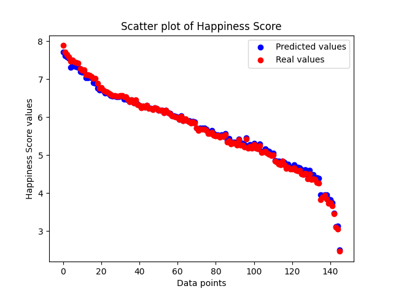
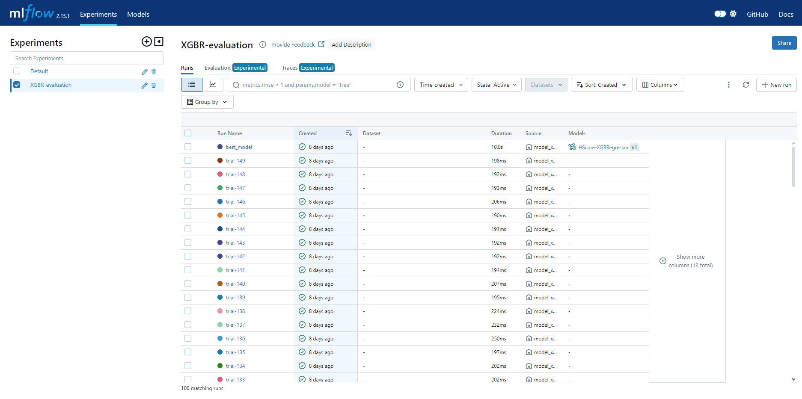

# Statistical Project: Analysis of Happiness Index and GDP per Capita
## Project Overview
In this project, we utilize data that includes the "Happiness Index" (Happiness Score, HS) calculated for various countries. We will examine the relationship between the variables "Explained by: GDP per capita" (referred to as GDPpc) and "Happiness Score" (referred to as HS).

- [World Happiness Report 2023](https://www.kaggle.com/datasets/ajaypalsinghlo/world-happiness-report-2023)
- [World Happiness Report 2022](https://www.kaggle.com/datasets/hemil26/world-happiness-report-2022/data)

## Task 1: Basic Numerical Characteristics

### Measures of Central Tendency
From Table 1, we observe that for the GDPpc variable, the mean is less than the median, and the median is less than the mode, which suggests a left-skewed distribution. For the HS variable, the median is slightly higher than the mean, but the mode is lower than the mean. At this point, it is difficult to determine the skewness of this distribution.

### Measures of Position
- The first quartile shows that 25% of the HS values are not greater than 4.889, and for GDPpc, it is 1.095.
- The third quartile shows that 75% of the HS values are not greater than 6.305, and for GDPpc, it is 1.785.

### Measures of Dispersion
- The coefficient of variation indicates low variability for HS and average variability for GDPpc. 
- The quartile coefficient of variation for GDPpc is noticeably higher than the classical coefficient, unlike HS, where both coefficients are comparable.

## Task 2: Classical and Non-Classical Measures

### Classical Measures
- **Third Central Moment**: Indicates weak left-skewness for both variables.
- **Fourth Relative Central Moment**: Suggests a flattened distribution for both variables.

### Non-Classical Measures
- **Quartile Skewness Coefficient for HS**: Indicates a right-skewed distribution.
- **Quartile Skewness Coefficient for GDPpc**: Indicates a left-skewed distribution.

Using classical and non-classical measures, we obtain a consistent result for GDPpc, whereas for HS, classical measures suggest a left-skewed distribution, and non-classical measures suggest a right-skewed distribution. This discrepancy is likely due to the approximate symmetry of the distribution.

## Task 3: Histograms of the Variables
Histograms for the variables HS and GDPpc were generated to visually analyze their distributions.

## Task 4: Normality Tests (Shapiro-Wilk Test)

### Statistical Hypothesis
- **H0**: The distribution of the HS (similarly for GDPpc) variable is normal.
- **H1**: The distribution of the HS (GDPpc) variable is not normal.

### Significance Level
- α = 0.05

### Test Results
- **HS**: The distribution is consistent with normality (no reason to reject H0).
- **GDPpc**: The distribution is not normal, so we reject H0.

### Graphical Interpretation
- **GDPpc**: Since W < Wα, we reject H0 and accept H1.
- **HS**: Since W > Wα, we accept H0.

## Task 5: Confidence Interval

### Confidence Interval for HS
A confidence interval (in the form [lower bound, upper bound]) was calculated using the normal distribution, assuming a large sample size, at a confidence level of 95%.

We can conclude that the true mean of this variable lies within this interval with a 95% probability. The confidence interval was also compared to the HS histogram.

## Task 6: Bivariate Normality Test (Mardia's Test)

### Statistical Hypothesis
- **H0**: The data comes from a normal distribution.
- **H1**: The data does not come from a normal distribution.

### Significance Level
- α = 0.05

### Test Results
The p-value is smaller than our assumed significance level for both skewness and kurtosis, so we reject H0 and accept H1. The bivariate vector (HS and GDPpc) does not follow a normal distribution.

## Task 7: Omitted
This task was omitted as Mardia's test rejected the null hypothesis.

## Task 8: Spearman's Rank Correlation Coefficient

### Correlation Coefficient
- The Spearman's rank correlation coefficient (rho) between HS and GDPpc is 0.821.

### Hypothesis Testing
- **H0**: There is no correlation between the variables (rho = 0).
- **H1**: There is a correlation between the variables (rho ≠ 0).

### Significance Level
- α = 0.05

### Test Result
The test statistic u = rho * sqrt(n-1) is 9.89, which is greater than the critical value of 1.96 for the normal distribution N(0,1) at α = 0.05. Therefore, we reject H0 in favor of H1.

### Graphical Interpretation
The variables GDPpc and HS are highly correlated, as indicated by the value of rho = 0.821, where rho ∈ [-1,1].

## Task 10: Regression Model

### Hypothesis
We suspect a causal relationship between the HS and GDPpc variables. Exploring the methodology for determining the "Happiness Index," we found that HS is derived from the sum of several parameters, including GDPpc. Therefore, attempting to build a regression model is justified.

- **Dependent Variable**: HS
- **Independent Variable**: GDPpc

### Normality Assumption
The previous test in Task 5 showed that we could assume the HS variable follows a normal distribution.

### Regression Equation
- y = 2.7773 + 1.9684x

### Hypothesis Testing
- **H0**: βi = 0
- **H1**: βi ≠ 0

### Significance Level
- α = 0.05

### Test Results
Both coefficients are significant (Pr(>|t|<0.05)), leading us to accept H1. The F-statistic test also confirms the significance of the R² coefficient.

### Interpretation
- **β1 (Intercept)**: Indicates the value of Y when X = 0. Here, β1 = 2.7773.
- **β2 (Slope)**: Indicates the rate at which Y increases with X. Here, Y increases approximately twice as fast as X.
- **R² = 0.5832**: This value suggests that just over half of the variance in HS is explained by the variability in GDPpc.
- **Standard Error (se) = 0.7041**: This value suggests that the residual standard deviation is not very large compared to the HS variable.

### Visualization
Scatter plots and regression lines were generated to visually represent the relationship between the observed values and the regression line.

## Conclusion
This project concludes that there is a significant relationship between GDP per capita and the Happiness Score. The regression model indicates that GDPpc has a strong influence on HS, as shown by the correlation and regression analyses.

## Machine Learning Analysis

### Task 1: Data Transformation
The `data_transformation` data_transformation_module preprocesses data from the World Happiness Report. It includes:
- **Column Renaming**: Standardizes column names.
- **Data Saving**: Saves transformed datasets as CSV files.

### Task 2: Model Training
Script: model_xgboost.py
The `model_xgboost.py` script trains an XGBoost regressor on the 2022 dataset. It includes:
- **Data Loading**: Reads the 2022 dataset and splits it into training and testing sets.
- **Feature Scaling**: Applies `StandardScaler` to normalize features
- **Model Training**: Trains an XGBoost model with predefined hyperparameters.
- **Model Saving**: Saves the trained model and scaler for future use.
- **Visualization**: Generates scatter plots comparing predicted vs. actual Happiness Scores.

### Task 3: Model Evaluation
Script: `model_xgboost_evaluation.py`
The `model_xgboost_evaluation.py` script evaluates and optimizes the XGBoost model using the 2023 dataset. It involves:

- **Data Preparation**: Loads and scales the 2023 dataset.
- **Hyperparameter Optimization**: Uses Optuna to find the best model configuration.
- **MLflow Logging**: Logs the best model and its parameters to the MLflow tracking server.

### Task 4: Model Testing
Script: `xgboost_test.py`
The `xgboost_test.py` script tests the best XGBoost model on the 2023 dataset. Key steps include:

- **Model Loading**: Retrieves the best model and scaler from MLflow.
- **Data Scaling**: Applies the saved scaler to the test data.
- **Prediction**: Uses the loaded model to predict Happiness Scores.
- **Visualization**: Creates a scatter plot comparing predicted values with actual values.

### RESULTS

## Machine Learning Model: XGBoost Regressor for Happiness Score Prediction

In this section, we detail the training, evaluation, and deployment of an XGBoost Regressor model used to predict the Happiness Score (HS) based on various features from the dataset. The model was trained and managed using MLflow for experiment tracking and model versioning.

### Model Training
Script: `model_xgboost.py`

The script `model_xgboost.py` trains an XGBoost Regressor model using the dataset. Key features include:

- **Features**: The model uses various features from the dataset to predict the Happiness Score.
- **Target**: Happiness Score (HS).
- **Hyperparameters**:
  - `colsample_bytree`: 0.9148
  - `gamma`: 0.0003
  - `learning_rate`: 0.0978
  - `max_depth`: 4
  - `min_child_weight`: 1
  - `n_estimators`: 73
  - `reg_alpha`: 0.0195
  - `reg_lambda`: 0.1217
  - `subsample`: 0.7451
- **Performance Metric**: The model achieved an R² score of 0.99995 on the test set, indicating an excellent fit to the data.

### Experiment Tracking with MLflow
MLflow was used for tracking experiments, managing models, and storing artifacts. The model was registered under the name `HScore-XGBRegressor`.

1. **MLflow Tracking**: The experiments were logged in MLflow, capturing metrics such as RMSE, hyperparameters, and versioning.
2. **Model Registry**: The final model was registered as version 1 in the MLflow Model Registry.

### Model Evaluation
Script: `model_xgboost_evaluation.py`

The evaluation script loads the trained XGBoost Regressor from the MLflow Model Registry and performs predictions on the test dataset. The performance of the model is visually compared to the actual values.

1. **Scaler Loading**: The script uses a pre-fitted `StandardScaler` loaded from `scaler.pkl` to standardize the test features.
2. **Prediction and Visualization**: The predictions are compared against the true values using a scatter plot.

#### Scatter Plot of Predictions
The plot below shows the predicted Happiness Scores against the actual scores. The blue dots represent predicted values, while the red dots are the actual values.

The plot demonstrates that the predicted values closely follow the actual values, confirming the high accuracy of the model.

### MLflow UI Screenshot
The screenshot below from the MLflow UI shows the experiments and runs conducted during the model development process:

The MLflow interface displays various runs, along with the metrics and models associated with each run. The best model was selected based on the lowest RMSE and registered in the model registry.

### Model Inference
Script: `xgboost_test.py`

To perform inference using the registered model:
The `xgboost_test.py` script loads the latest version of the XGBoost Regressor from MLflow and applies it to new data. The results are visualized in a scatter plot comparing the predicted and real Happiness Scores.